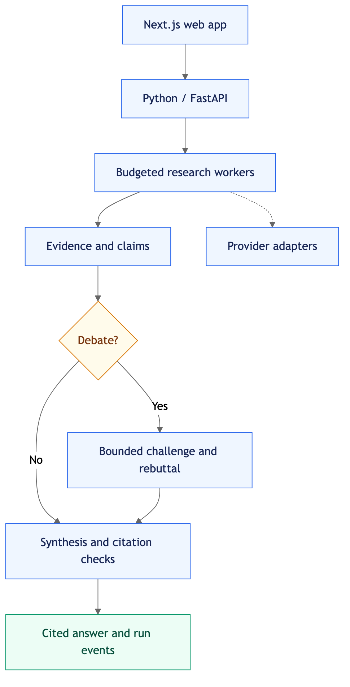

# Architecture

Status: accepted direction; application behavior, APIs, and paths below are proposed.
The repository currently establishes guidance and research, not a running product.

Vigilante is a personal research application with a fast cited-answer path,
parallel research for broader questions, and optional bounded multiagent debate.
Own orchestration, evidence, and the experience; initially buy search and extraction.
The [landscape review](docs/research/research-agent-landscape-2026-09-29.md) motivates
these choices. Performance targets in that review remain unmeasured hypotheses.

## Boundaries

The preview is a static image so it displays without Mermaid support. See the
[editable Mermaid source](docs/diagrams/architecture.mmd) and
[rendering instructions](docs/diagrams/README.md).

Runtime flow: web app → API → budgeted research → evidence records → optional debate
→ synthesis and citation checks → cited output. Researchers use external providers
through adapters; run events stream to the web client throughout execution.
This shows runtime flow, not the direction of source-code dependencies.

| Location | Responsibility |
| --- | --- |
| `apps/api/` | Python asynchronous application, with FastAPI planned for transport. |
| `apps/web/` | Next.js and TypeScript experience, source inspection, progress, cancellation. |
| `contracts/` | Reserved for versioned wire schemas and compatibility fixtures. |
| `evals/` | Evaluation cases, scoring guidance, and reproducible experiment records. |
| `scripts/` | Repository tooling; add commands only when implemented and verified. |
| `docs/research/` | Dated research and its limitations. |
| `docs/decisions/` | Architecture decisions and tradeoffs. |

Start with one API deployment and one web application. Add queues, separate workers,
databases, or caches only for a named reliability or measured capacity need.
Select compatible runtime/tooling versions with the runnable skeleton. Use evaluation
results to select providers; add persistence and hosting for explicit delivery needs.

## Backend feature domains

| Domain | Owns |
| --- | --- |
| `research` | Scope, strategy selection, independent subquestions, coordinator, synthesis. |
| `evidence` | Source identity, snapshots, passages, claim support, citation verification. |
| `debate` | Initial positions, material objections, bounded rebuttals, adjudication. |
| `providers` | Adapters for model, search, and extraction services; normalized failures/usage. |
| `runs` | Lifecycle, event records, budget accounting, deadlines, cancellation. |

Domain rules and records must not import FastAPI, model SDKs, or orchestration frameworks.
Application use cases call interfaces owned by the domain that needs them; adapters
implement those interfaces. Transport validates wire input and calls use cases.
The composition layer supplies adapters; feature modules must not construct SDK clients.
Provider response objects, prompts, and credentials never become browser contracts.
Evaluate a small asynchronous coordinator before adopting a larger agent harness.

## Execution and resource limits

1. Validate the request, source scope, requested mode, and server-enforced budget.
2. Route to a single researcher or a bounded set of independent research tasks.
3. Batch searches, deduplicate URLs/queries, retrieve passages, and record provenance.
4. Produce useful cited provisional content when supported evidence is available.
5. If requested or materially useful, obtain independent positions and run bounded debate.
6. Synthesize once from structured evidence; verify material claims and their citations.
7. Record terminal state and expose the result, limitations, and remaining disagreements.

Every task shares a run deadline and ceilings for tokens, estimated spend, tool calls,
concurrency, and debate rounds. Reserve capacity for final synthesis and verification.
Use bounded concurrency, operation timeouts, bounded retries with backoff, and provider
rate-limit handling. Admission must account for in-flight work before dispatch.
Record actual usage where available and label estimated or unavailable usage honestly.
Cancellation propagates to children and stops new work; already accepted remote calls
may still finish or incur charges. Do not treat an SSE disconnect as cancellation.
When a deadline or provider failure prevents completion, return available evidence as
a partial result with an explicit reason. Never silently promote an unchecked draft.

## Evidence and debate

Source records retain requested/canonical URLs, source identity, retrieval time, and
observed publication/update dates. Snapshots preserve retrieved content or an explicit
retention limitation; a content hash detects changes but cannot reconstruct a page.
Stable passage IDs identify excerpts within a captured snapshot. Final material claims
map to these passages with support status; a bibliography alone is insufficient.
Citation checks cover source existence, passage identity, claim support, and dates.
Distinguish extracted passages from provider-generated summaries and correlated sources.

Debate begins with independent positions before peer answers are shared. Objections
must identify a claim, evidence, or assumption; allow bounded retrieval and rebuttal.
An evidence-based judge may preserve uncertainty or unresolved disagreement. Agreement
and vote count are not verification. Retain positions, revisions, and cited rationale;
the product exposes useful evidence and decisions without requiring hidden chain of thought.
See [ADR 0002](docs/decisions/0002-evidence-and-debate.md).

## Proposed run contract

The following operations describe intent, not implemented or stable endpoints:

| Operation | Proposed resource |
| --- | --- |
| Create a run | `POST /runs` |
| Read authoritative state and available result | `GET /runs/{run_id}` |
| Subscribe/reconnect to events | `GET /runs/{run_id}/events` using SSE |
| Request cancellation | `POST /runs/{run_id}/cancel` |

Proposed states: `queued`, `running`, `cancelling`, `completed`, `failed`, `cancelled`.
Output quality is separate: `provisional` while checking, `partial` when requested work
remains incomplete, and `final` when the completed answer has passed the defined checks.
`completed` can carry a partial result and a reason such as budget exhaustion.
Cancellation acknowledgement is not terminal cancellation; handle completion races.
Serialize terminal transitions so one terminal outcome is authoritative for each run.

Proposed event fields are schema version, event ID, run ID, monotonic per-run sequence,
timestamp, event type, and typed payload. Candidate events cover state, phase, evidence,
answer revisions, usage, and recoverable errors. Replay may repeat events; clients
deduplicate by ID. Resume from a cursor within a documented retention window; on an
expired cursor, fetch run state rather than silently dropping a gap. Heartbeats carry
no claims. Specify schemas, authorization, and fixtures in `contracts/` before shipping.

## Trust and delivery gates

Keep credentials and provider calls on the API side. Treat retrieved content and agent
outputs as untrusted data. Enforce URL/redirect/network access policies in fetch tools;
source text cannot grant permissions. Render source content without executing it.
Scope run access, snapshots, and future caches to the owning user/workspace. Redact
secrets and avoid logging full private documents; define retention before storing them.

First establish the runnable skeleton, then a 30–50-case provider/single-researcher
baseline, then compare parallel research and bounded debate. Use separate equal-cost
and equal-deadline trials. Include fixed evidence and live-web cases, a human-reviewed
subset, and repeated cold/warm trials.
Measure correctness, claim/citation support, contrary evidence, harmful answer changes,
first useful cited output, final checked output, p50/p95 latency, timeouts, and cost.
Include extra retrieval as a control for debate. Choose providers and models from
reproducible results; record the selection in an ADR before application expansion.
See [ADR 0001](docs/decisions/0001-runtime-and-boundaries.md).
