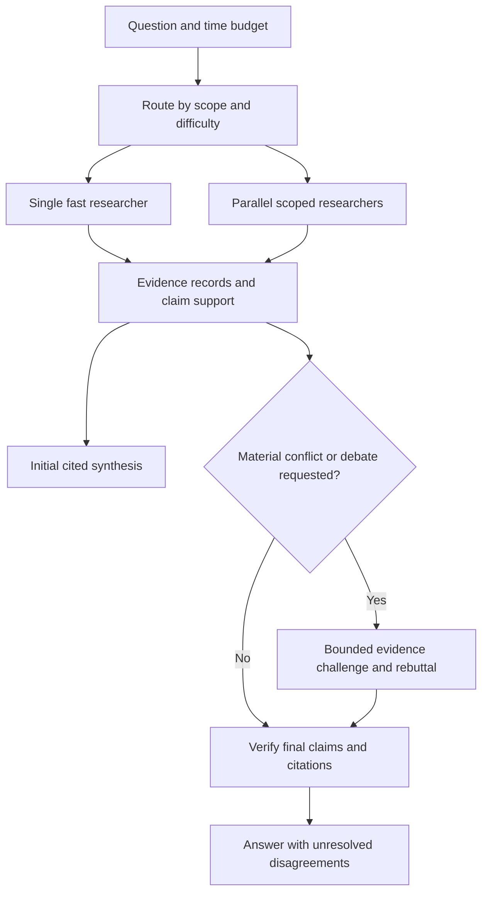

**Fast research agents and multiagent debate — landscape review, September 29, 2026**

Recommendation: build a fast answer path, parallelize independent research, and offer bounded debate for disputed claims and questions that benefit from competing interpretations. Own the orchestration, evidence records, and user experience; initially buy search and extraction infrastructure. Treat this as a design hypothesis to evaluate, not a demonstrated advantage over existing products.

This review assumes general web research resembling Perplexity. It covers official product documentation, engineering articles, public repositories, and research papers. Three parallel research tracks examined open source, infrastructure, and debate evidence. No dedicated `/deep-research` command was available, so the review used live web research. No product trials, paid API benchmarks, or application implementation were performed. Vendor performance claims are identified as such; proposed latency budgets are unmeasured targets. Recheck this landscape by October 29, 2026, and verify API details before implementation.

The most consequential market finding is that model councils already exist in mainstream products. Perplexity's July 2026 update lets users choose two to eight models and analysis depth, then synthesizes agreements, disagreements, and unique findings into work products. Its documented independent analysis and synthesis should not automatically be treated as a repeated adversarial debate protocol. A generic council is therefore an existing feature, while control over speed, evidence, and disagreement resolution remains a useful product direction to investigate. [Perplexity Model Council in Computer](https://www.perplexity.ai/en-GB/hub/blog/model-council-comes-to-computer)

Several patterns are often called “multiagent,” but they have different costs and purposes:

| Pattern | What happens | Best reason to use it |
|---|---|---|
| Parallel research | Workers investigate different subquestions simultaneously. | Broader evidence coverage and a shorter critical path. |
| Independent council | Several models answer the same question before seeing peers' answers; a synthesizer compares them. | Expose alternative interpretations and omissions. |
| Critique and revision | A reviewer checks a draft and a writer revises it. | Identify unsupported claims or incomplete analysis. |
| Debate | Agents exchange objections and evidence, then reconsider positions. | Resolve material disagreements when an additional reasoning or retrieval step could help. |

These are operational definitions for this review. A system can combine them; using multiple models does not itself establish independent evidence or greater correctness.

The commercial market is moving toward configurable research effort, source controls, multiple models, and outputs that continue into other workflows.

| Product | Verified public approach | Implication for this project |
|---|---|---|
| Perplexity | Model Council offers independent model analysis and synthesis. Deep Research is integrated into Computer, where research can become reports, spreadsheets, and other artifacts. [June 18, 2026 update](https://www.perplexity.ai/changelog/deep-research-command-panel-forking-inline-actions-and-enterprise-controls) | A personal alternative should make control and inspectability useful, rather than relying on council availability as a novel feature. |
| Claude Research | A lead researcher delegates to parallel workers, with a later citation step. Anthropic's June 2025 article reports a 90.2% improvement over single-agent Opus 4 on its internal research evaluation, up to 90% less research time from parallelization, and approximately 15× chat token usage. These are vendor measurements on specific configurations, not universal improvements or a 15× single-agent comparison. [Engineering account](https://www.anthropic.com/engineering/multi-agent-research-system) | Parallelism can improve coverage and elapsed time while increasing total work. Allocate effort by question complexity. |
| Gemini Deep Research / Max | The April 21, 2026 announcement distinguishes an interactive, speed-oriented agent from Max, which spends more compute on comprehensive background research. It adds MCP/custom sources, planning controls, and streaming. [Google announcement](https://blog.google/innovation-and-ai/models-and-research/gemini-models/next-generation-gemini-deep-research/) | Separate interactive answering from extended research; expose effort as a deliberate choice. |
| ChatGPT Deep Research | The February 10, 2026 update adds connected apps/MCP, trusted-site restrictions, live progress, and the ability to interrupt and refine research. [OpenAI update](https://openai.com/index/introducing-deep-research/) | Source selection and steerability are important capabilities alongside answer quality. Older launch-time completion estimates should not be used as current comparative benchmarks. |
| Microsoft 365 Researcher | Its March 2026 update distinguishes Critique, with separate generator and reviewer models, from Council, with independent GPT/Claude reports and a comparison summary. [Microsoft announcement](https://techcommunity.microsoft.com/blog/microsoft-copilot-blog/introducing-multi-model-intelligence-in-researcher/4506011), [current Council support page](https://support.microsoft.com/en-us/microsoft-365-copilot/use-model-council-with-researcher-in-microsoft-365-copilot) | Both reviewing and comparing models are already productized. The support page describes Council as a Frontier early-access feature. |
| You.com Research API | The April 2026 update emphasizes source/domain/freshness controls and JSON-schema outputs. Its public architecture description includes a single agent with substantial reasoning budgets. [API controls announcement](https://about.you.com/resources/new-you-dot-com-research-api-controls) | Strong research is not synonymous with more agents. A capable single researcher is an essential baseline. |

Perplexity is also changing the retrieval interface. Its Search as Code design exposes retrieval, ranking, filtering, and other primitives to code running in a sandbox, allowing batching and intermediate processing before results enter model context. The relevant lesson for an initial implementation is to execute predictable retrieval operations efficiently in code and keep unnecessary intermediate text out of model prompts. Replicating its underlying search stack is a much larger undertaking. [Perplexity engineering article](https://research.perplexity.ai/articles/rethinking-search-as-code-generation)

An API migration affects old tutorials: Perplexity's August 13 announcement scheduled Sonar endpoints to retire September 27, 2026, in favor of the Agent API. That date has passed as of this review; this review did not probe endpoint behavior. A new integration should start from current Agent API documentation and verify supported endpoints. [Official migration announcement](https://community.perplexity.ai/t/sonar-is-moving-to-the-agent-api/5802)

The open-source landscape offers useful components and design references, with several important status changes.

| Project | Architecture and relevance | Status and interpretation |
|---|---|---|
| [Vane, formerly Perplexica](https://github.com/ItzCrazyKns/Vane) | Self-hosted answering engine with SearxNG, local/cloud models, citations, streaming, and Speed/Balanced/Quality modes. | MIT. Good product and fast-answer reference. Its documented research workflow does not establish an adversarial debate implementation. |
| [LangChain Open Deep Research](https://github.com/langchain-ai/open_deep_research) | Supervisor, independent researchers, compressed findings, final synthesis. | MIT; **archived August 21, 2026**. Study the architecture; do not choose it on the assumption that it is actively maintained. README leaderboard results are dated 2025. |
| [LangChain Deep Agents](https://github.com/langchain-ai/deepagents) | General harness with planning, isolated subagents, filesystem/context offloading, memory, and tools. | MIT; current release activity. Evaluate against a small custom asynchronous controller; its capabilities do not automatically constitute a debate system. |
| [GPT Researcher](https://github.com/assafelovic/gpt-researcher) | Planning, retrieval/crawling, source handling, report synthesis, and configurable recursive research. Its [LangGraph team](https://docs.gptr.dev/docs/gpt-researcher/multi_agents/langgraph) includes parallel research and reviewer/revisor loops. | Apache-2.0. [v3.7.0, September 26, 2026](https://github.com/assafelovic/gpt-researcher/releases/tag/v3.7.0), adds relevance filtering and fixes repeated content in multiagent sections. Strong research/report lifecycle reference. |
| [STORM / Co-STORM](https://github.com/stanford-oval/storm) | Perspective-driven research interviews; Co-STORM adds expert discussion, moderation, user participation, and a mind map. | MIT, academic reference. Useful for question discovery and structured discourse. Collaborative exploration is not necessarily adversarial debate, and low latency is not its established advantage. |
| [DeerFlow 2.x](https://github.com/bytedance/deer-flow) | General agent harness with lead agent, subagents, skills, memory, and sandboxed execution. | MIT. Active architecture is a rewrite; original research workflow remains on [main-1.x](https://github.com/bytedance/deer-flow/tree/main-1.x). Relevant if the product expands into a broader workspace. |
| [Jina node-DeepResearch](https://github.com/jina-ai/node-DeepResearch) | Iterative search/read/reason workflow, knowledge-gap discovery, answer evaluation, and token-budget stopping; aims at concise answers. | Apache-2.0. Useful algorithmic reference for answering sufficiently without always generating a long report. Current maintenance intensity was not established. |
| [Tongyi DeepResearch](https://github.com/Alibaba-NLP/DeepResearch) | Trained search-agent model with ReAct and heavier IterResearch inference. | Relevant to eventual model ownership. Training/inference research is a different investment from building the first product. Heavy inference should not be presumed fast; inspect model-specific licensing before reuse. |

One practical lesson from LangChain's architecture work is to parallelize research while retaining coherent final synthesis: independently drafted sections can become disjoint. This does not require every worker to send an entire conversation transcript to the writer. [LangChain architecture article, July 2025](https://www.langchain.com/blog/open-deep-research)

Retrieval providers increasingly expose explicit speed/quality controls. The following are candidates for a measured comparison, not a ranking. Prices are public units observed during this review; complete answer cost also includes inference, extraction, retries, and any deeper research.

| Provider | Relevant capabilities | What to evaluate |
|---|---|---|
| Perplexity Search | Fast Search costs $1 per 1,000 successful requests versus $5 for standard search; fast is intended for everyday agent loops, standard for rare/difficult/ambiguous questions. [Fast Search docs](https://docs.perplexity.ai/docs/search/fast-search) | The September 24 announcement claims 95% of search results within 230 ms. This is vendor-reported retrieval performance, not complete-answer latency. [Announcement](https://community.perplexity.ai/t/introducing-fast-search-in-the-perplexity-search-api/6195) |
| Parallel | Turbo, fast, basic, and advanced search modes, relevant excerpts, plus separate extraction and research products. [Modes](https://docs.parallel.ai/search/modes) | Compare compact evidence quality and tail latency. Published approximate mode timings are not a cross-provider controlled benchmark. |
| Exa | Instant, fast, auto, deep-lite, deep, and deep-reasoning search; page text/highlights and structured synthesis options. [Search reference](https://exa.ai/docs/reference/search) | Compare latency-oriented modes with deeper retrieval for obscure queries. Keep retrieval timing separate from synthesized output timing. |
| Tavily | Ultra-fast, fast, basic, and advanced modes; content formats differ by mode. [Search reference](https://docs.tavily.com/documentation/api-reference/endpoint/search) | Check whether returned content is a source passage or generated summary; this affects evidence verification. |
| Brave | LLM Context returns extracted chunks and source metadata with total/per-source token budgets. [Context documentation](https://api-dashboard.search.brave.com/documentation/services/llm-context) | Compare useful evidence per token, source diversity, freshness, and budget controls. |
| Firecrawl | Search with optional scraping, batch scraping, PDFs, and cache/freshness controls. [Scrape documentation](https://docs.firecrawl.dev/features/scrape) | Evaluate as extraction infrastructure for pages that search snippets cannot adequately support. Force fresh retrieval when the question demands it. |
| Jina | Reader for URL extraction; hosted DeepSearch has team size, token budget, effort, and attempt controls. [Reader](https://jina.ai/reader/), [DeepSearch](https://jina.ai/deepsearch/) | The hosted team can research independent subproblems in parallel with a shared token budget. This is a concrete precedent for budgeted delegation, distinct from the open-source controller above. |

For ownership, there are three reasonable paths. A UI over a hosted research API is quickest to assemble but gives less control over research and debate. A custom orchestrator over search/extraction APIs gives control over scheduling, evidence, and models with manageable infrastructure scope. Owning a search index or training a research model adds a substantially larger operational and research burden. The middle path best matches the stated goal; this is a scope recommendation, not a measured cost comparison.

The academic evidence does not support treating debate as an automatic accuracy upgrade.

| Evidence | What the study found | Boundary on the conclusion |
|---|---|---|
| [Debate or Vote, NeurIPS 2025](https://proceedings.nips.cc/paper_files/paper/2025/hash/934252acd87f254d5d4672fbde283bd2-Abstract-Conference.html) | Across seven benchmarks, independent majority voting explained most gains commonly attributed to debate. | Its formal result uses assumptions about agent behavior; it does not rule out useful heterogeneous debate that retrieves new evidence. |
| [Multi-Agent Reasoning Improves Compute Efficiency, ACL Student Research Workshop, July 2026](https://aclanthology.org/2026.acl-srw.1/) | At comparable compute, debate and mixture-of-agents improved over self-consistency by 1.3 and 2.7 percentage points in the reported comparison. | Reasoning benchmarks, primarily Llama 3.1 70B; compute was estimated from inference operations/memory, not measured end-to-end web/API latency. |
| [iMAD, AAAI 2026](https://ojs.aaai.org/index.php/AAAI/article/view/40181) | A router selectively invokes debate. On MEDQA it reports 82.0% accuracy at 1,300 average tokens versus full MAD's 81.9% at 4,034. | QA/VQA results, not live-web performance. Its headline 92% token reduction uses GroupDebate as comparator; it is not a universal reduction versus all baselines. |
| [Talk Isn't Always Cheap, 2025](https://arxiv.org/abs/2509.05396) | Peer interaction can change correct answers into incorrect answers, including with heterogeneous agents. | Limited models/tasks; useful failure evidence rather than proof that all debate is harmful. |
| [Who Is the Agent to Blame?, August 25, 2026](https://arxiv.org/abs/2608.24306) | In an AI-Q analysis, 84.7% of final-report faithfulness/citation errors originated in the orchestrator. | System-specific study; diagnostic analysis used 20 English tasks. This supports testing synthesis and evidence handoffs rather than assuming reliable workers guarantee a reliable report. |

My inference from these sources is to support debate explicitly, but make it conditional and measurable. Start with independent positions; share evidence afterward; allow agents to retain uncertainty. Agreement is not proof, and forcing a judge to choose can conceal unresolved conflicts.

The proposed flow below is a research-informed design sketch, not an implementation specification:

An evidence record should preserve the original URL, canonical/source identity, captured passage, stable passage ID, retrieval timestamp, observed publication/update date, and supported claims. Retain a source snapshot or content hash for reproducibility. A final claim must map to supporting passages, not just a bibliography. Multiple websites repeating one announcement count as correlated evidence. Source text and worker outputs remain data, with no authority to change tool permissions or research instructions.

For actual debate, use two or three independent initial assessments on the disputed proposition. A challenger must identify unsupported reasoning, conflicting evidence, or a missing assumption. Permit a targeted retrieval/rebuttal step, followed by evidence-based adjudication. Keep the original positions, revisions, source links, and remaining disagreement visible. Cap rounds, elapsed time, total tokens, tool calls, and concurrency. A common budget must include the final verification and synthesis rather than allowing workers to consume it all.

The speed strategy should focus on reducing sequential model turns and unnecessary data movement. Batch independent searches; fetch promising sources concurrently; deduplicate URLs and repeated queries; extract only useful passages; use a smaller model for routine extraction when it meets quality checks; reserve stronger reasoning for synthesis or difficult disputes. Stream useful cited findings when available, with provisional status if checking continues. Surface substantive corrections explicitly. Cache with freshness rules tied to the question, and cancel or return bounded partial results when a provider stalls.

Initial product budgets could be:

| Mode | Proposed workload | Initial target, to validate |
|---|---|---|
| Fast | Straightforward question, a small set of supporting sources, short answer. | First useful cited content in 2–5 seconds where feasible; completed answer in 10–20 seconds. |
| Research | Comparison or broader question, two to four scoped researchers. | A supported synthesis in 30–60 seconds for ordinary pages. |
| Deep | Hard discovery, long documents, extensive cross-checking or explicit debate. | User-selected deadline measured in minutes, with progressive output. |

These are hypotheses for initial design, not performance promises or demonstrated parity with commercial deep research. A complete report across difficult PDFs may not fit a short budget. Time to first token, first useful cited content, and final checked answer must be recorded separately. The debate option needs an explicit allowance within the total deadline, and the user should see when requested depth exceeds it.

Before choosing a framework or provider, run a small evaluation around actual intended use. Start with 30–50 questions spanning current facts, comparisons, obscure discovery, conflicting sources, and long documents. Repeat trials; include cold/warm caches and concurrent load. Keep a fixed evidence corpus for reproducible reasoning comparisons and a live-web set for retrieval/freshness. Hold synthesis models and evidence budgets constant when comparing search vendors.

Compare these strategies under both equal-dollar and equal-wall-clock constraints: one strong researcher; parallel researchers with synthesis; researcher plus reviewer; independent council; parallel research plus bounded debate; and the same extra budget spent on additional retrieval. Separate critique, new retrieval, and final judging in ablations. This reveals whether debate itself helps and whether the routing decision spends effort on the right questions.

Track factual correctness, citation support, coverage of material claims, source independence, temporal correctness, omitted contrary evidence, correct-to-incorrect revisions, unnecessary or missed debate triggers, p50/p95 latency, timeout rate, and total cost per satisfactorily answered question. Review a human-checked subset rather than relying entirely on an LLM grader. Select configurations that improve quality at an acceptable latency/cost, rather than rewarding the number of agents or sources.

Use public benchmarks as supplements. [BrowseComp](https://openai.com/index/browsecomp/) tests hard information discovery with short answers; it is not a complete proxy for open-ended reports. [DeepResearch Bench](https://deepresearch-bench.github.io/) evaluates report quality and citation behavior. [DeepResearch Bench II](https://arxiv.org/abs/2601.08536), January 2026, adds fine-grained rubrics for information recall, analysis, and presentation. Avoid comparing vendor leaderboard scores as if model versions, retrieval access, budgets, and evaluation dates were identical.

For the first project decision, study Vane for the answer experience, Open Deep Research for the research topology, GPT Researcher for retrieval/report handling, and Co-STORM for structured discussion. Evaluate a small asynchronous orchestrator alongside current Deep Agents only after the baseline workload is defined. The strongest initial experiment is whether an inspectable, bounded debate produces a better supported answer than additional retrieval within the same budget. That experiment directly tests the requested combination of speed and multiagent debate.
